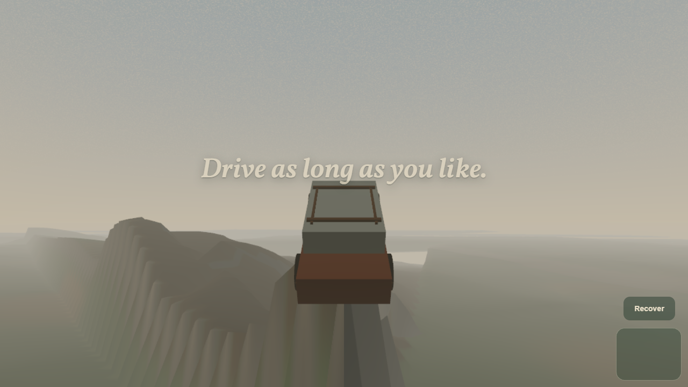
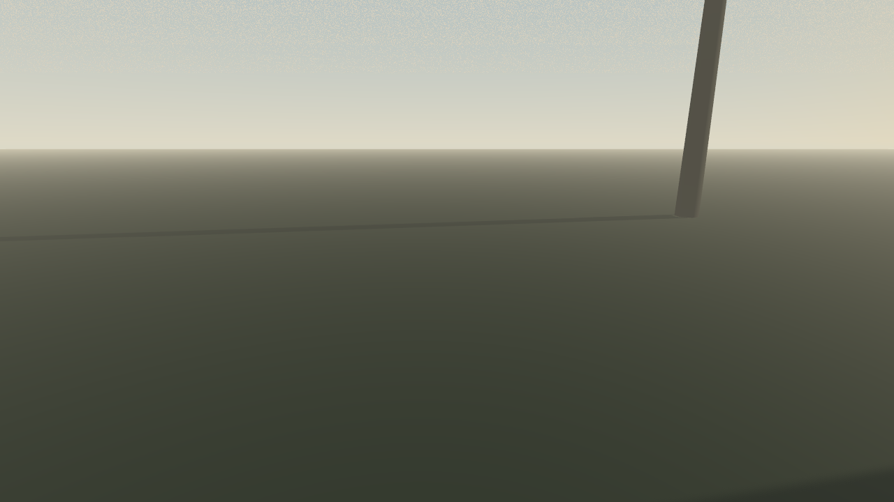
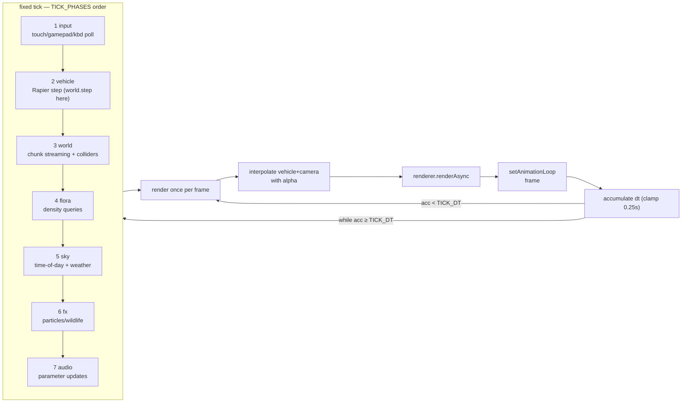

# Understory

> A calm endless-forest driving game for the browser. No score. No timers. Nothing
> to win — just a trail that keeps going.



Understory streams an infinite procedurally generated forest around your car and
invites you to drive through it as slowly or as long as you like. The world is
deterministic: enter any seed and everyone gets the same forest, byte-identical.
It renders WebGPU-first with an automatic WebGL2 fallback (AgX tone mapping),
simulates the vehicle on Rapier's raycast chassis at a fixed 60 Hz, and generates
terrain in a pooled worker pool so streaming never spikes the frame budget.

## Status

**Work in progress — pre-alpha (`v0.1.0`).** The engine core is real and measured
(see [docs/architecture.md](docs/architecture.md) and
[docs/release-notes-draft.md](docs/release-notes-draft.md) for exactly what works
and what does not yet): terrain streaming, vehicle physics, sky/weather, audio
and UI shell are implemented and unit-tested, and a first pass of forest life has
landed on top:

- **The Trace** — <kbd>M</kbd> opens the plate view of the trail you've driven.
- **Photo mode** — <kbd>P</kbd> pauses the world and exports a 2× PNG.
- **Trees** — four species placed by the deterministic flora pass (pine, plus
  birch/oak/snag whose rendering is still wired separately).
- **Life & particles** — pooled rain, fireflies, motes, leaves and birds, with a
  reduced-motion kill switch wired through settings to the fx systems and rig.
- **Accessibility** — key-remap collision logic (swap + explain) and
  `prefers-reduced-motion` / `prefers-contrast` CSS support landed.

Still ahead, honestly: merging the per-species render wiring into one pipeline,
clearing the last residual post-load shader compiles, running the frame gate on
real GPU hardware (current measurements are headless software-rasteriser
proxies — see [docs/PERF.md](docs/PERF.md)), undergrowth/grass, and audio
spatialisation upgrades. The screenshots above are from the current integrated
boot on a dev machine, not final art.

| | |
|---|---|
| Sky at golden hour, fixed-seed verification render |  |

## Controls

Keyboard bindings are remappable in-game (Escape → Controls) and persist to
`localStorage`. Gamepad uses the standard mapping; touch controls appear on first
touch. Sources combine: steering sums and clamps, throttle/brake take the max,
and Recover is edge-latched so one press is never delivered twice
(`src/vehicle/input.ts`, `src/vehicle/bindings.ts`).

### Keyboard (defaults)

| Action | Keys | Notes |
|---|---|---|
| Throttle | <kbd>W</kbd> or <kbd>↑</kbd> | digital 1.0 |
| Brake / reverse | <kbd>S</kbd> or <kbd>↓</kbd> | digital 1.0 |
| Steer left / right | <kbd>A</kbd> / <kbd>D</kbd> or <kbd>←</kbd> / <kbd>→</kbd> | sums & clamps to ±1 |
| Handbrake | <kbd>Space</kbd> | folds into the brake channel at 0.6 strength, rear-axle bias — slides gently, cannot spin the car |
| Recover | <kbd>R</kbd> | 1.4 s righting window; also auto-triggers after 1.5 s tipped |

Any key except <kbd>Escape</kbd>/modifier keys also dismisses the opening
line and starts driving; <kbd>Escape</kbd> opens pause/settings at any time.

### Gamepad (standard mapping)

| Control | Action | Notes |
|---|---|---|
| Left stick X | Steer | true analog, smoothstep deadzone **0.14** |
| RT (button 7) / A | Throttle | analog trigger value |
| LT (button 6) / B | Brake | analog trigger value |
| X (button 2) | Handbrake | → brake channel |
| Y (button 3) | Recover | edge-latched |
| D-pad | Digital steer/throttle fallback | layers on top of the stick (steer floors at ±0.7) |

### Touch

| Gesture | Action | Notes |
|---|---|---|
| Drag anywhere in the left half of the screen | Steer | horizontal offset from touch start, ±64 px → −1..1, deadzone 0.08; releases recenter |
| Right vertical pad, drag up | Throttle | analog by drag height |
| Right vertical pad, drag down | Brake | analog by drag height |
| **Recover** button above the pad | Recover | |

## Getting started

Requires **Node.js ≥ 22** and pnpm (enable via `corepack enable`, Node 22 ships
Corepack).

```sh
git clone https://github.com/<owner>/understory.git
cd understory
pnpm install

pnpm dev        # dev server (vite)
pnpm test       # unit tests (vitest run)
pnpm e2e        # Playwright end-to-end against `pnpm preview` on :4173
pnpm verify     # typecheck + lint + test + build — what CI runs
pnpm build      # production build to dist/ (base path /understory/)
pnpm preview    # serve the built dist/
```

## Dependencies

Exact pinned versions from `package.json` (the project pins without carets;
`pnpm-lock.yaml` resolves these identities verbatim):

| Package | Version | Role |
|---|---|---|
| [`three`](https://www.npmjs.com/package/three) | `0.185.1` | WebGPU/WebGL2 renderer, TSL node materials |
| [`@dimforge/rapier3d-compat`](https://www.npmjs.com/package/@dimforge/rapier3d-compat) | `0.20.0` | physics: raycast vehicle + heightfield colliders |
| [`typescript`](https://www.npmjs.com/package/typescript) | `5.9.3` | typechecker (see [ADR 0002](docs/adr/0002-typescript-5-pin.md)) |
| [`vite`](https://www.npmjs.com/package/vite) | `8.2.2` | dev server + build (ES2022 target, ES module workers) |
| [`vitest`](https://www.npmjs.com/package/vitest) | `4.1.11` | unit tests |
| [`eslint`](https://www.npmjs.com/package/eslint) | `10.9.0` (+`@eslint/js` `10.0.1`, `typescript-eslint` `8.67.0`) | linting |
| [`prettier`](https://www.npmjs.com/package/prettier) | `3.9.6` | formatting |
| [`@playwright/test`](https://www.npmjs.com/package/@playwright/test) | `1.62.1` | e2e (chromium) |
| [`@types/three`](https://www.npmjs.com/package/@types/three) | `0.185.4` | three typings |

## Architecture

Everything runs off one fixed-timestep loop driven by
`renderer.setAnimationLoop` (`src/contracts/frame.ts`): wall-clock dt is clamped
to 0.25 s, accumulated, and drained as up to N fixed ticks; then the frame renders
once, interpolating transforms with `alpha = acc/TICK_DT`.



The signal store flushes to the DOM once per **frame**, never per tick, and no
phase allocates (all vectors/quaternions preallocated).

Subsystems and their homes:

| Subsystem | Path | What it owns |
|---|---|---|
| Render core & loop | `src/core/` | WebGPU-first renderer w/ WebGL2 fallback, 60 Hz accumulator loop, quality tiers, debug HUD (`?debug=1`) |
| World generation | `src/world/` | seeded noise, chunk streaming, LOD rings, worker pool, heightfield colliders, TSL surface material |
| Vehicle & input | `src/vehicle/` | soft-tuned Rapier vehicle, keyboard/gamepad/touch sources, remappable bindings |
| Sky & atmosphere | `src/sky/` | analytic sky model, 40-min day cycle, weather crossfades, clouds, height fog, sun/moon shadows |
| Audio | `src/audio/` | fully synthesised soundscape (zero shipped audio assets), immutable node graph |
| UI shell | `src/ui/` | opening line, diegetic HUD, pause/settings panel, accessibility |
| Contracts | `src/contracts/` | the interfaces every subsystem implements (frame order lives in `frame.ts`) |

See [docs/architecture.md](docs/architecture.md) for the full diagram, agent
ownership map and wave status.

## How the forest is generated

Everything below is deterministic integer/float math seeded by splitmix32 — no
`Math.random`, no platform variance. The same seed produces byte-identical
heightmaps on main thread and workers alike (unit-tested), and every consumer
(colliders, future flora, CPU queries like `heightAt`) samples the *same*
function in `src/world/terrain-source.ts`.

**Heightfield stack (seeded simplex FBM + domain warp).** Six layers compose:
a very-low-frequency base continent shape; rolling hills as warped FBM; ridged
multifractal gated to high ground; power-shaped valleys that deepen low ground;
flat meadow clearings where a clearing mask fires; and finally the trail carve.
Each layer warps its sample position by lower-frequency noise before evaluating,
which breaks up grid-aligned artefacts and gives the terrain its organic drift.
(`noise.ts` provides the splitmix32 PRNG, seeded permutation tables, 2D simplex,
FBM and ridged multifractal; simplex output is hard-clamped to [−1, 1] so even
adversarial inputs stay deterministic.)

**Warped-spline trail network.** A supergrid of junction nodes every **192 m**;
each node sits at a seeded jitter inside its cell. Grid edges (east + south of
every node) form the network — it is everywhere connected, so there is always an
invitation to follow and never a dead end. Every edge is a quadratic Bézier bent
sideways by seeded jitter plus a large-scale noise bend (±46 m warp), so trails
meander like footpaths rather than grid lines. `TrailField` — a spatial hash with
24 m cells and segment-AABB insertion — answers "how close am I to a trail?"
queries fast: carving a full-res chunk went from ~330 ms brute-force to
**~42 ms p50 (~7.9× faster)** with bit-identical results
([world-terrain notes](docs/notes/world-terrain.md)). Trail influence lowers
terrain height toward a compacted-dirt bed and sets the surface mask the vehicle's
grip model reads.

**Ring LOD pooling.** Five Chebyshev rings of chunks surround the car chunk — a
~640 m guaranteed radius, ~1.2 km diagonal reach. Inner rings (0–1) render the
full 1 m vertex grid; outer rings decimate with per-ring steps `[1, 1, 2, 4, 8]`.
Every chunk mesh carries a downward skirt so T-junction cracks between LOD levels
never show sky through the terrain. BufferGeometries are allocated once per LOD
level and recycled forever (shared index buffers, analytic bounding spheres,
central-difference normals); eviction recycles instead of freeing. Generation
runs in a worker pool sized `max(1, min(hardwareConcurrency−1, 8))` with
round-robin least-loaded dispatch and **transferable** result arrays (full-res
129² chunk ≈ **42–45 ms p50** off-thread; geometry fill on main thread ≤ ~5 ms).
A 3×3 ring of Rapier heightfield colliders follows the car, created/destroyed as
the ring crosses chunk boundaries.

## Deploying

Static hosting only — `pnpm build` emits `dist/`. The Vite base path is
**`/understory/`** ([ADR 0003](docs/adr/0003-vite-base-path.md)), which matches
GitHub Pages' project-site URL `https://<owner>.github.io/<repo>/` *assuming the
repo is named `understory`*. This repo currently has no `origin` configured, so
that assumption is documented rather than verified — if you deploy under a
different name (or a user domain at root), change `base` in `vite.config.ts`
accordingly. `.github/workflows/ci.yml` builds, verifies and publishes `dist/`
to GitHub Pages via `actions/deploy-pages` on pushes to `main`; enable
**Settings → Pages → Source: GitHub Actions** once on the repository.

## License

MIT — see [LICENSE](LICENSE).
