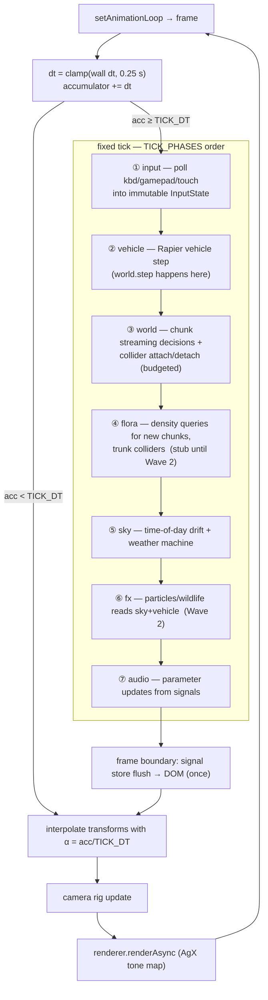

# Understory — Architecture

Companion to the README diagram. This page is the single place that records
**what runs when**, **who owns what**, and **how far along each piece is**.

## The loop

`renderer.setAnimationLoop(frame)` drives everything (WebGPU-safe). Each frame:

1. Accumulate wall dt, clamped to 0.25 s.
2. Drain up to `MAX_TICKS_PER_FRAME` fixed ticks at `TICK_DT` (60 Hz), in the
   phase order fixed by `src/contracts/frame.ts`.
3. Render once: interpolate vehicle + chase-camera transforms with
   `alpha = acc / TICK_DT`, update the camera rig, `renderAsync` via PostProcessing.

Rules enforced by contract and test: no allocations inside any phase; UI touches
the DOM only at the frame-boundary signal-store flush, never during ticks.

### Subsystem wiring

| Phase | Subsystem | Entry point | Notes |
|---|---|---|---|
| — | render core | `src/core/renderer.ts`, `src/core/loop.ts` | WebGPU-first, WebGL2 retry fallback; per-phase ms timing |
| ① | input | `src/vehicle/input.ts` (`InputSystemImpl.poll`) | sources combine: steer sum+clamp, throttle/brake max, recover edge-latched |
| ② | vehicle | `src/vehicle/vehicle.ts` (`SoftVehicle.fixedUpdate`) | owns `world.step()`; tree-contact softening post-step |
| ③ | world | `src/world/terrain-world.ts` (+ `chunk-streamer.ts`) | worker-pool generation, LRU cache feeds Rapier heightfields (3×3 ring) |
| ④ | flora | `src/flora/` | **Wave 2 stub** — density-query contract only |
| ⑤ | sky | `src/sky/SkySystemImpl.ts` | emits `light/changed`, `weather/changed`; supplies fog/atmosphere to materials |
| ⑥ | fx | `src/fx/` | **Wave 2 stub** |
| ⑦ | audio | `src/audio/bus.ts` | immutable graph; extra `setSky()` outside contract pending decision |
| frame | ui | `src/ui/shell.ts` | HUD speed/time-of-day set per tick, DOM flush once per frame |

## Ownership map

Hard rule from [PLAN.md](PLAN.md): agents write only inside owned directories
plus their own note file (`docs/notes/<agent>.md`) and own tests. Cross-dir
changes are reported as requested diffs, never applied.

| Agent | Branch | Owns |
|---|---|---|
| A render-core | `feat/render-core` | `src/core/`, `tests/*core*` |
| B world-terrain | `feat/world-terrain` | `src/world/`, `tests/world-*` |
| C vehicle-input | `feat/vehicle-input` | `src/vehicle/`, `tests/vehicle-*` |
| D sky-atmosphere | `feat/sky-atmosphere` | `src/sky/`, `tests/sky*` |
| E ui-shell | `feat/ui-shell` | `src/ui/`, `tests/ui-*` |
| F audio | `feat/audio` | `src/audio/`, `tests/audio-*` |
| G flora | `feat/flora` | `src/flora/` |
| H life-and-particles | `feat/life-particles` | `src/fx/` |
| I the-trace | `feat/the-trace` | `src/ui/trace*`, photo mode |
| J perf-and-quality | `feat/perf-quality` | quality tiers, `docs/PERF.md` |
| K art-direction-pass | `feat/art-pass` | typography/motion/copy fixes |
| L qa-verification | `e2e/` | Playwright specs, CI evidence |
| **L2 docs-and-deploy** | `feat/docs-deploy` | `README.md`, `.github/workflows/`, `docs/architecture*`, release-notes draft, Pages config |
| M a11y-and-comfort | `feat/a11y-comfort` | `src/ui/settings*` |

## Wave status

| Wave | Scope | Status |
|---|---|---|
| 0 | scaffold, contracts, verify-green empty project | ✅ done |
| 1 | six subsystem agents (A–F), integrated to `main` | ✅ done & integrated (boot wires world/vehicle/sky/ui/audio into the fixed loop) |
| 1.5 | vertical-slice perf gate — p99 ≤ 20 ms over 3-min drive, zero post-load shader compiles | 🚧 in flight (blocking for Wave 2) |
| 2 | flora, particles/wildlife, the Trace/photo mode, perf tiers, art pass (G–K) | ⏳ pending |
| 3 | e2e QA (L), docs & deploy (L2 — this branch), a11y settings (M) | 🚧 in flight (L2 delivered here; L/M pending) |
| 4 | orchestrator integration pass, release notes, tag v0.1.0 | ⏳ pending |

Measured evidence per claim lives in `docs/notes/*.md`; the honest not-finished
list lives in [`docs/release-notes-draft.md`](release-notes-draft.md).
